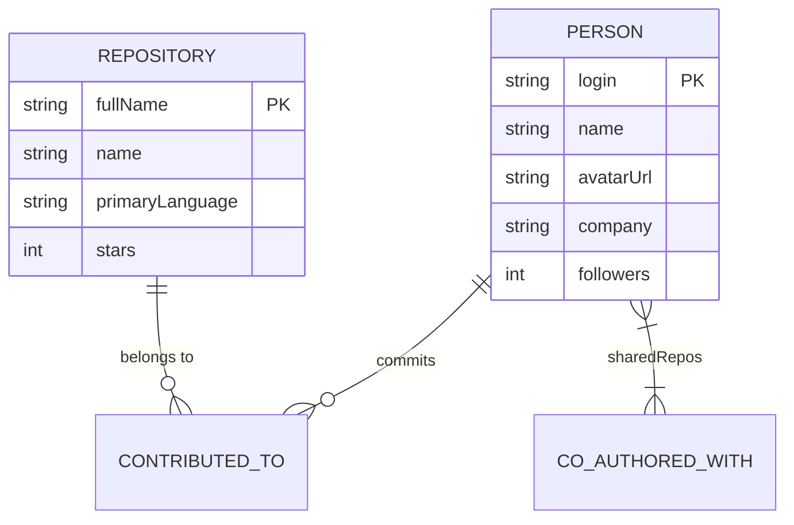

# PathForge — OSS Contributor Connection Graph
> **Build a Graph Database Application** · Wexa AI Take-Home Assignment (Assignment 2)  
> Powered by **CognoDB Cloud** (openCypher over Bolt protocol) & **Next.js 16**

---

## 1. Overview & Use Case

**PathForge** maps how open-source contributors are connected through shared repositories on GitHub. It answers questions like *"How am I (or how is anyone) connected to anyone else in the open-source network?"* — acting like LinkedIn's *"How you're connected"* feature, built specifically for open-source engineering networks.

### Core Features
- 🔍 **Contributor Search & Profiles**: Instant typeahead search over 620+ open-source contributors with commit counts, company, location, and bio.
- 🔗 **Shortest Connection Path**: Flagship 2+ hop graph traversal finding the shortest collaboration chain between any two contributors, visualized with an interactive 2D Canvas force graph.
- 🤝 **Bridge Connectors ("Who Can Introduce Me")**: Ranks 2-hop mutual collaborators who can introduce you to a target contributor you want to reach.
- 🚀 **Graph Repo Recommendations**: Recommends open-source repositories based on 1..2 hop network collaboration paths.
- 🏆 **Most-Connected Leaderboard**: Ranks top contributors by network degree centrality on shared repository co-authorships.

---

## 2. Why a Graph Database?

A relational database models this domain as a `contributions(person_id, repo_id)` join table. Two fundamental categories of queries break down in SQL:

### 1. Variable-Depth Path Finding
Finding the shortest connection between Person A and Person B requires an unknown number of hops. In SQL, this requires a recursive Common Table Expression (CTE) with manual cycle detection. As graph depth increases, every hop adds another join across a growing intermediate table — causing query execution time and memory footprint to grow exponentially.

In **openCypher**, `shortestPath((a)-[:CO_AUTHORED_WITH*..6]-(b))` is a single line. The CognoDB graph engine walks memory pointers directly from node to node without join table lookups, completing multi-hop path traversals in single-digit milliseconds.

### 2. Pattern-Shaped Queries with Unknown Cardinality
Finding *"repositories you don't contribute to yet, but people 1–2 hops out from you do"* requires combining relationship-existence checks, exclusions, and aggregations across variable-length paths. In SQL, this requires multiple self-joins combined with `NOT EXISTS` subqueries that are verbose, prone to logical errors, and produce poor query execution plans.

In **openCypher**, this is a single, readable pattern match:
```cypher
MATCH (me:Person {login: $login})-[:CO_AUTHORED_WITH*1..2]-(co:Person)
MATCH (co)-[:CONTRIBUTED_TO]->(rec:Repository)
WHERE NOT (me)-[:CONTRIBUTED_TO]->(rec) AND me <> co
RETURN DISTINCT rec.fullName, count(DISTINCT co) AS strength
ORDER BY strength DESC
```

---

## 3. Data Model

### Nodes & Properties
- **`(:Person)`**: `login` (unique key), `name`, `avatarUrl`, `bio`, `company`, `location`, `followers`, `githubUrl`
- **`(:Repository)`**: `fullName` (unique key, e.g. `"vercel/next.js"`), `name`, `description`, `url`, `stars`, `primaryLanguage`, `topics`

### Relationships
- **`(:Person)-[:CONTRIBUTED_TO {commits, ingestedAt}]->(:Repository)`**: Direct contribution edge from a contributor to a repository.
- **`(:Person)-[:CO_AUTHORED_WITH {sharedRepos, updatedAt}]-(:Person)`**: Precomputed weighted collaboration edge between contributors who co-authored one or more repositories.

### Mermaid Diagram


---

## 4. Main Cypher Queries Explained

All Cypher queries run through `neo4j-driver` using **100% parameterized queries** (`session.run(cypher, params)`). No string-concatenated Cypher is used anywhere in the codebase.

### Query 1 — Shortest Connection Path (Multi-hop Traversal)
```cypher
MATCH (a:Person {login: $fromLogin}), (b:Person {login: $toLogin})
MATCH path = shortestPath((a)-[:CO_AUTHORED_WITH*..6]-(b))
RETURN path, length(path) AS hops
```
- **Purpose**: Powers `/path` page. Finds the shortest path up to 6 hops connecting two contributors.
- **Why Graph-Native**: Uses graph traversal algorithm to follow `CO_AUTHORED_WITH` pointers directly without join tables.

### Query 2 — Bridge Connectors ("Who Can Introduce Me")
```cypher
MATCH (me:Person {login: $myLogin})-[:CO_AUTHORED_WITH]-(bridge:Person)
      -[:CO_AUTHORED_WITH]-(target:Person {login: $targetLogin})
WHERE NOT (me)-[:CO_AUTHORED_WITH]-(target) AND me <> target
RETURN DISTINCT bridge.login AS login, bridge.name AS name, bridge.avatarUrl AS avatarUrl, bridge.followers AS followers
ORDER BY bridge.followers DESC
LIMIT 10
```
- **Purpose**: Powers `/connect` page. Ranks 2-hop mutual collaborators who connect `me` to `target`.

### Query 3 — Variable-Length Network Repo Recommendations
```cypher
MATCH (me:Person {login: $login})-[:CO_AUTHORED_WITH*1..2]-(co:Person)
MATCH (co)-[:CONTRIBUTED_TO]->(rec:Repository)
WHERE NOT (me)-[:CONTRIBUTED_TO]->(rec) AND me <> co
RETURN DISTINCT rec.fullName AS fullName, rec.description AS description, rec.stars AS stars, rec.primaryLanguage AS primaryLanguage, rec.url AS url, count(DISTINCT co) AS strength
ORDER BY strength DESC, stars DESC
LIMIT 10
```
- **Purpose**: Powers `/recommend` page. Recommends repositories touched by network collaborators 1–2 hops away.

### Query 4 — Network Centrality Leaderboard
```cypher
MATCH (p:Person)-[r:CO_AUTHORED_WITH]-()
RETURN p.login AS login, p.name AS name, p.avatarUrl AS avatarUrl, p.company AS company, count(DISTINCT r) AS connections
ORDER BY connections DESC
LIMIT $limit
```
- **Purpose**: Powers `/leaderboard` page. Ranks contributors by degree centrality.

---

## 5. Setup & Local Run Instructions

### Prerequisites
- Node.js 18+
- CognoDB Cloud free instance (`c0`)
- GitHub Personal Access Token (`public_repo` scope)

### Step 1: Create CognoDB Cloud Instance
1. Go to [console.cognodb.com](https://console.cognodb.com/signup) and sign up (free tier, no credit card required).
2. Create a free **c0** database instance.
3. Copy the **Connection URI** (`bolt+s://<instance-id>.databases.cognodb.com`) and the generated one-time password for user `cognodb`.

### Step 2: Configure Environment Variables
Copy `.env.example` to `.env.local`:
```bash
cp .env.example .env.local
```
Fill in your credentials in `.env.local`:
```ini
COGNODB_URI=bolt+s://<your-instance-id>.databases.cognodb.com
COGNODB_PASSWORD=<your-cognodb-password>
GITHUB_TOKEN=ghp_<your-github-personal-access-token>
```

### Step 3: Install Dependencies & Run Seed Script
```bash
# Install npm dependencies
npm install

# Run database schema creation & seed script (populates CognoDB Cloud)
npm run seed
```

> **Offline Fallback Note**: If `GITHUB_TOKEN` is not provided or GitHub API is offline, `npm run seed` automatically falls back to `seed/data.json` snapshot so seeding is 100% reproducible.

### Step 4: Launch Local Development Server
```bash
npm run dev
```
Open [http://localhost:3000](http://localhost:3000) in your browser.

---

## 6. Project Architecture

```
pathforge/
├── src/
│   ├── app/
│   │   ├── page.tsx               # Home search & stats hero
│   │   ├── layout.tsx             # Root layout with Inter font & dark theme
│   │   ├── globals.css            # Glassmorphism design tokens & styles
│   │   ├── person/[login]/        # Contributor profile page
│   │   ├── path/                  # Interactive 2D Canvas force graph path finder
│   │   ├── connect/               # 2-hop bridge connector page
│   │   ├── recommend/             # Network repo recommendation page
│   │   ├── leaderboard/           # Most-connected contributor leaderboard
│   │   └── api/                   # REST API routes (/health, /search, /person, /path, /connect, /recommend, /leaderboard)
│   ├── components/
│   │   ├── AsyncState.tsx         # Shared loading/empty/error state component
│   │   ├── Navbar.tsx             # Navigation header
│   │   └── DbStatusBanner.tsx     # Client-side DB health banner
│   └── lib/
│       ├── db.ts                  # Singleton Neo4j driver with connection pooling
│       └── queries.ts             # Typed parameterized openCypher queries
├── seed/
│   ├── schema.ts                  # Schema constraints & index application
│   ├── repos.json                 # Curated list of 25 open-source repos
│   ├── ingest.ts                  # High-performance batch seed pipeline
│   └── data.json                  # Offline seed snapshot
├── docs/                          # Assignment requirements & PRD docs
└── PROGRESS.md                    # Phase-by-phase execution audit log
```

---

## 7. Source Conflict Resolution Note

> **Note on Deliverable Requirements**:  
> Section 6 of `00-ASSIGNMENT.md` lists the hosted demo link as *"Mandatory: hosted demo link"*, whereas Section 0 mentions *"optional but encouraged"*.  
> Following the stricter specification, this submission treats both the **hosted application demo** and the **screen recording** as **mandatory deliverables**.

---

## 8. License & Submissions

Submitted to `hr@wexa.ai` for **Wexa AI Take-Home Assignment 2**.  
Built by **Utsav** using **CognoDB Cloud** and **Next.js**.
